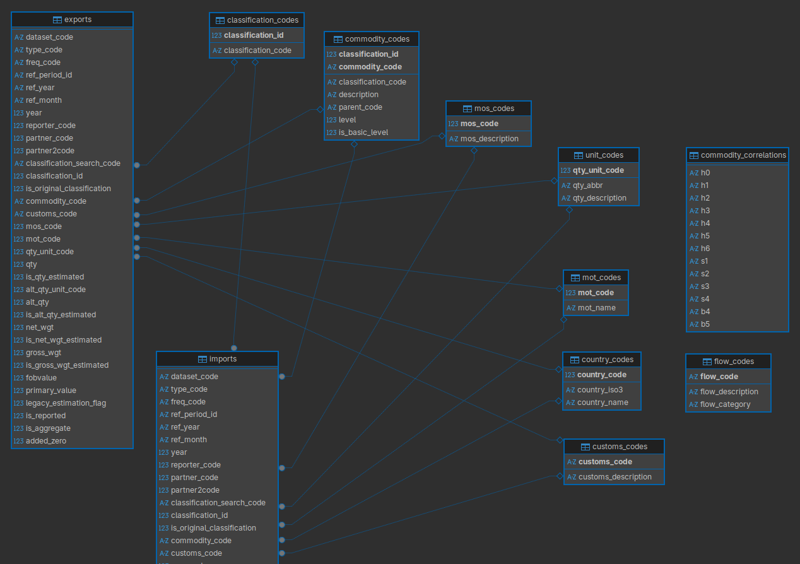

# UN COMTRADE Datasets in Arrow Parquet

These script download the UN Comtrade Plus dataset from 1962 to 2025.

The downloaded files are saved locally in RDS and then organized into a PostgreSQL database.

To add to raw COMTRADE data I provide a script based on Hausman Lab (Harvard) to convert all records to HS22 (or H6) from the
original classifications provided by each reporter (e.g. HS92, SITC rev 2, etc).

The final tables are written to a PostgreSQL database.

These scripts reflect my personal workflow and ten years of working with intenational trade data. I have added multiple
data cleaning steps and transformations to provide consistent ISO-3 codes for reporters and partners, and to harmonize
the product classifications to HS22.

Running these scripts took around three days to complete, mostly because the downloads from UN Comtrade are slow and the
validation and cleaning steps are time consuming.

Clean Comtrade database diagram:

How to run:

1. Run `Rscript 01-download-data.r` (slow)
2. Run `Rscript 02-copy-to-sql.r`

Step 1 requires a UN COMTRADE token, which are usually ony available for paid accounts. Check with your university's library
for access.
